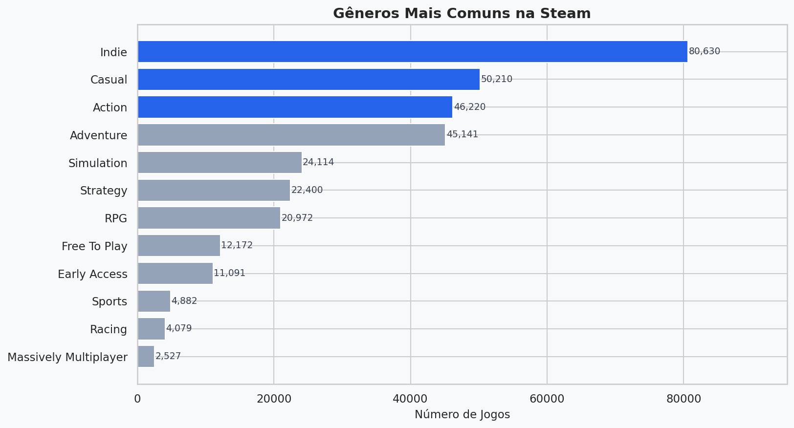
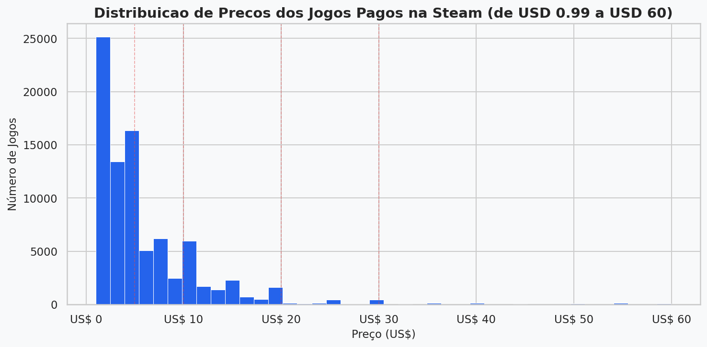
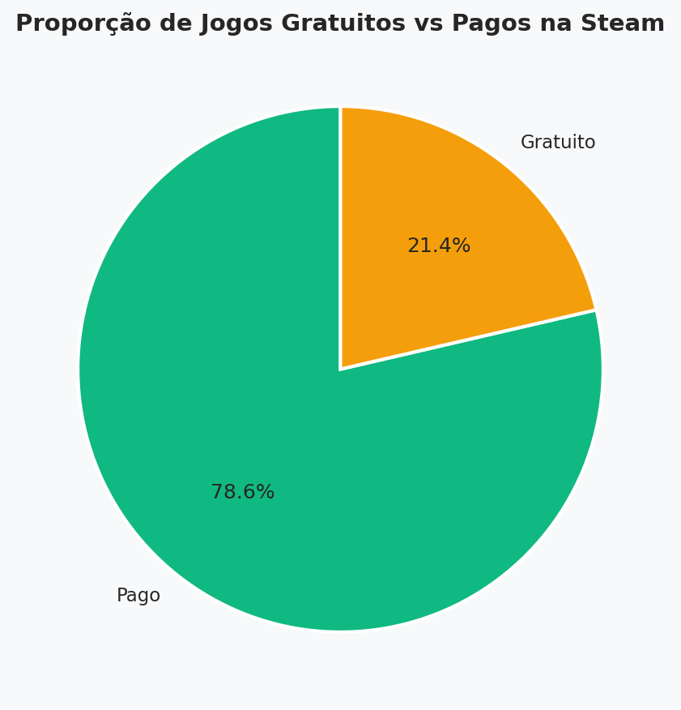
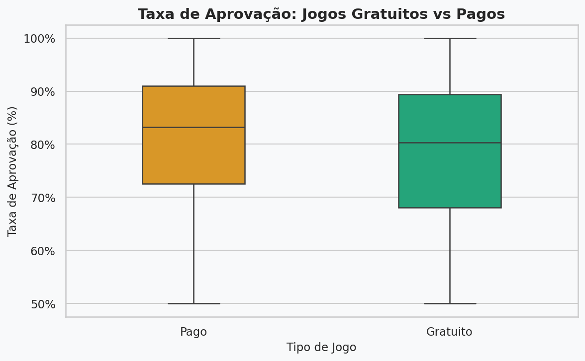
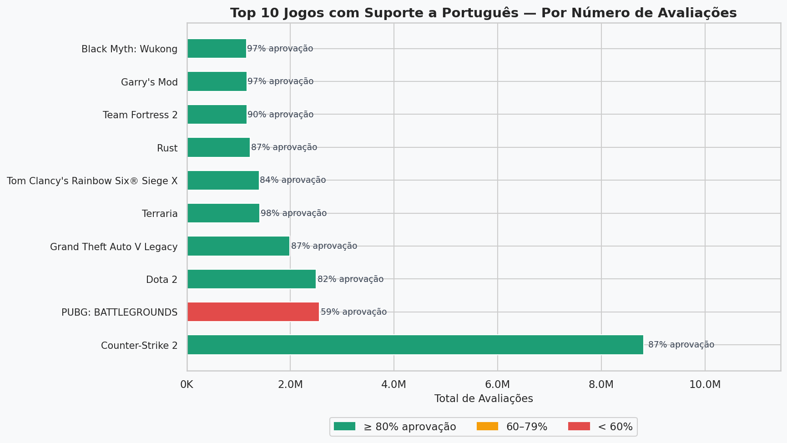

# 🎮 Análise do Mercado Gamer na Steam

Análise exploratória de mais de 122.000 jogos da plataforma Steam, com foco no mercado brasileiro — suporte a português, jogos mais avaliados, distribuição de preços e gêneros mais populares.

---

## 🎯 Objetivo

Explorar o ecossistema de jogos da Steam respondendo perguntas como:

- Quais gêneros dominam a plataforma?
- Jogos gratuitos têm taxa de aprovação maior que jogos pagos?
- Quantos jogos têm suporte ao português brasileiro?
- Quais são os jogos mais populares com PT-BR?
- Como os preços se distribuem na plataforma?

---

## 📈 Principais Insights

- 💡 **17,7%** dos jogos da Steam têm suporte a Português (21.736 jogos)
- 💡 **Counter-Strike 2** é o jogo com mais avaliações entre os que têm PT-BR (8,8 milhões)
- 💡 **Terraria** (97,5%) e **Garry's Mod** (96,8%) são os mais bem avaliados do top 10 com PT-BR
- 💡 O preço mediano dos jogos pagos é **USD 3,49**
- 💡 **Indie** e **Casual** são os gêneros mais comuns na plataforma
- 💡 Jogos pagos têm aprovação média de **80,9%** vs **78,2%** dos gratuitos

---

## 🛠️ Tecnologias Utilizadas

| Ferramenta | Uso |
|---|---|
| `Python 3.11` | Linguagem principal |
| `Pandas` | Limpeza e análise dos dados |
| `Matplotlib` | Visualizações e gráficos |
| `Seaborn` | Gráficos estatísticos |

---

## 📁 Estrutura do Projeto

```
analise-mercado-gamer-steam/
│
├── analise_steam.py           # Script principal de análise
├── games.csv                  # Dataset original (Kaggle)
├── README.md
│
└── graficos/
    ├── 01_generos_mais_comuns.png
    ├── 02_distribuicao_precos.png
    ├── 03_gratuito_vs_pago.png
    ├── 04_aprovacao_gratuito_pago.png
    └── 05_top_jogos_ptbr.png
```

---

## 🚀 Como Executar

**1. Clone o repositório**
```bash
git clone https://github.com/LeoCarrer/analise-mercado-gamer-steam.git
cd analise-mercado-gamer-steam
```

**2. Instale as dependências**
```bash
pip install pandas matplotlib seaborn
```

**3. Baixe o dataset**

Acesse [Steam Games Dataset no Kaggle](https://www.kaggle.com/datasets/fronkongames/steam-games-dataset), baixe o arquivo `games.csv` e coloque na raiz do projeto.

**4. Execute a análise**
```bash
python analise_steam.py
```

Os gráficos serão gerados automaticamente na pasta `graficos/`.

---

## 📊 Visualizações

### Gêneros mais comuns na Steam


### Distribuição de preços dos jogos pagos


### Proporção de jogos gratuitos vs pagos


### Taxa de aprovação: gratuitos vs pagos


### Top 10 jogos com suporte a Português


---

## ⚠️ Observações técnicas

O dataset possui um deslocamento de colunas causado pela coluna `About the game`, que contém textos longos com vírgulas e quebras de linha. Para contornar isso, as colunas foram selecionadas por **posição numérica** via `iloc`, garantindo a leitura correta independente do deslocamento.

---

## 📦 Dataset

- Fonte: [Steam Games Dataset — Kaggle](https://www.kaggle.com/datasets/fronkongames/steam-games-dataset)
- Jogos: 122.611
- Colunas: 39
- Atualização: 2024

---

## 👤 Autor

**Leonardo Carrer Lemos**
Engenharia da Computação | Pós-graduação em Ciência de Dados e Big Data

- [LinkedIn](https://www.linkedin.com/in/leonardo-carrer-lemos/)
- [GitHub](https://github.com/LeoCarrer)
